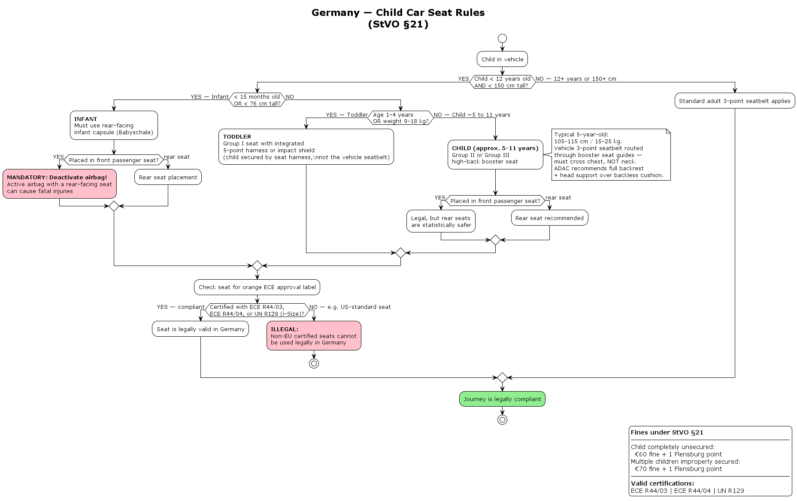

# Child Car Seat Rules — Germany (§21 StVO)

---

## Why Age, Height, and Weight?

The three criteria are not just labels to classify a child as infant, toddler, or child — each serves a specific safety purpose.

### Height

The most critical criterion. The standard 3-point adult seatbelt is designed for people roughly 150 cm and above — at that height it crosses the chest and collarbone correctly. Below that, it rides up across the neck, which is dangerous in a crash. This is why **150 cm is the exact cutoff for adult belt use**, not an arbitrary age.

### Weight

Determines whether the seat's harness and structure can safely bear the crash forces. A heavier child transfers more load — the seat must be rated for it.

### Age

A practical proxy — easy for parents to know, but imprecise because children grow at different rates. This is why age is always paired with height or weight as a fallback.

### Why Multiple Criteria Are Combined

A child might be 3 years old but already too tall or heavy for an infant capsule, so they move to the next seat type earlier than average. No single criterion alone is sufficient.

| Criterion | What it protects |
|---|---|
| Height | Correct seatbelt fit — belt must cross chest, not neck |
| Weight | Harness and seat structure rated for crash forces |
| Age | Approximate proxy for physical size |

---

## Key Thresholds

| Threshold | Rule |
|---|---|
| Under 12 years **and** under 150 cm | Child seat mandatory |
| Under 15 months **or** under 76 cm | Rear-facing infant capsule (Babyschale) |
| Age 1–4 **or** 9–18 kg | Group I seat with 5-point harness |
| 150 cm or older than 12 years | Standard adult 3-point seatbelt applies |

---

## Airbag Warning

A rear-facing infant seat placed on the **front passenger seat** requires the **airbag to be deactivated**. An active airbag deploying into a rear-facing seat can cause fatal injuries.

---

## Certification

The seat must carry an orange ECE approval label. Valid certifications in Germany:

- ECE R44/03
- ECE R44/04
- UN R129 (i-Size)

US-standard seats are not legally valid in Germany.
