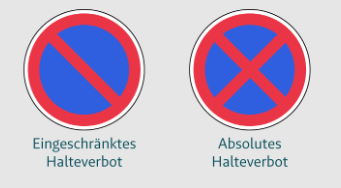

# Halten, Parken, Warten — Germany (StVO)

---

## The Three Terms

**Warten** — stopping because traffic forces you to. Red light, giving way, traffic jam. You have no choice. Never a violation of any sign.

**Halten** — voluntarily stopping, briefly, with the driver staying in the vehicle. Dropping someone off, picking someone up, loading. You chose to stop.

**Parken** — a form of Halten that has either lasted more than 3 minutes, or the driver has left the vehicle, even for a moment.

Warten cannot become Parken — because Warten is traffic-forced. The moment traffic clears and you choose to stay stopped, it becomes Halten. If it then extends beyond 3 minutes or you step out, it becomes Parken.

---

## The Signs

### Eingeschränktes Halteverbot — 1 stripe (Zeichen 286)

Prohibits **Parken**.

| | Allowed? |
|---|---|
| Warten | ✅ — traffic forced you |
| Halten | ✅ — brief stop, driver present |
| Parken | ❌ — prohibited |

### Absolutes Halteverbot — 2 stripes / X (Zeichen 283)

Prohibits **Halten** — and therefore Parken too.

| | Allowed? |
|---|---|
| Warten | ✅ — traffic forced you |
| Halten | ❌ — prohibited |
| Parken | ❌ — prohibited |

---

## Key Principle

Parken is a form of Halten — banning Halten automatically bans Parken. Warten is never banned because you cannot be penalised for what traffic forces upon you.
