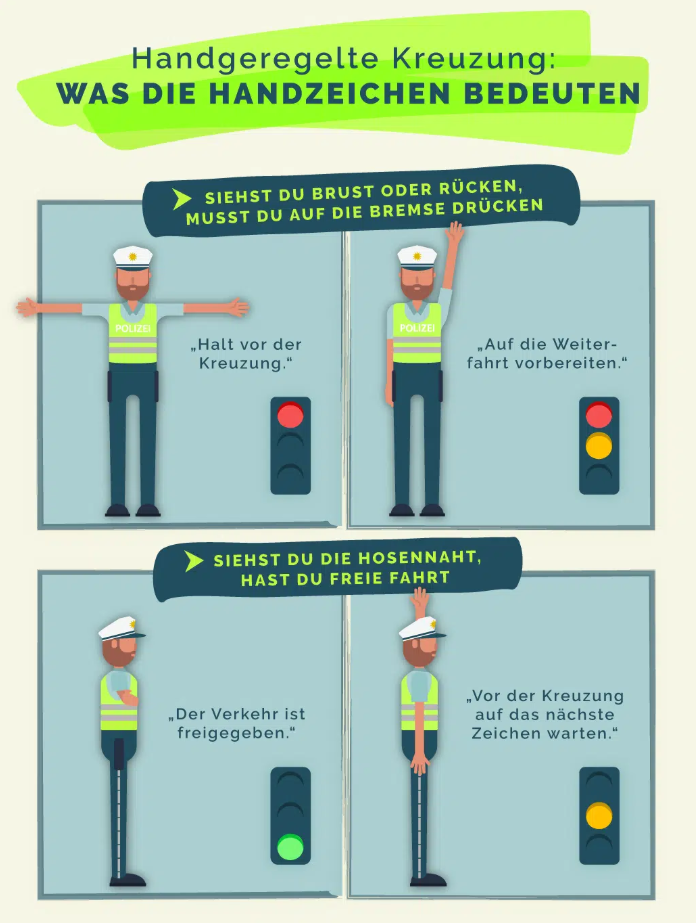

# Police Hand Signals (Polizeiliche Handzeichen)

---

> **Siehst du Brust oder Rücken, musst du auf die Bremse drücken.**
> **Siehst du die Hosennaht, hast du freie Fahrt!**

---

## Signals

### 🔴 Stop — Brust oder Rücken (Chest or Back)

When you see the officer's **chest or back**, the intersection is blocked for you. You must stop and wait.

### 🟡 Wait — Arm hochgehoben (Arm Raised)

When the officer raises **one arm straight up**, you must stop before the intersection and prepare for the next signal. A change is imminent.

### 🟢 Go — Hosennaht (Side Profile)

When you see the **side profile** of the officer (the seam of their trousers facing you), traffic running **parallel to the officer's shoulders** is free to go.

---

## Summary

| Signal | What you see | What it means |
|---|---|---|
| 🔴 Stop | Chest or back | Intersection blocked — stop |
| 🟡 Wait | One arm raised straight up | Prepare — signal about to change |
| 🟢 Go | Side profile (Hosennaht) | Traffic parallel to shoulders may proceed |
