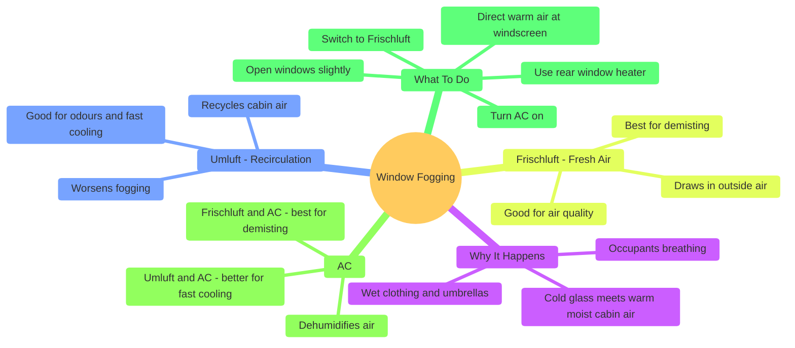

# Window Fogging (Beschlagene Scheiben)

## Overview

A fogged windscreen is not just an inconvenience — driving with impaired visibility is dangerous and illegal in Germany. Understanding why windows fog up and how to respond correctly is an important part of the German Führerschein theory exam.

---

## Why Do Windows Fog Up?

Window fogging occurs due to a simple physical process: **warm, moist air inside the cabin meets the cold surface of the glass**, causing water vapour to condense into tiny droplets on the window.

The key ingredient is **moisture inside the car**. The most common sources are:

- **Occupants breathing** — every breath adds water vapour to the cabin air
- **Wet clothing and umbrellas** — water evaporates from damp items inside the car
- **Rain entering the cabin** — through open windows or doors

The problem is especially common in cold weather, when the glass temperature is low and the temperature difference between the glass and the cabin air is large.

---

## Ventilation Modes: Umluft vs Frischluft

Modern cars allow you to choose where the ventilation system draws its air from. This choice has a significant impact on how effectively you can clear a fogged windscreen.

### Umluft (Recirculation Mode)

In Umluft mode, the ventilation system **recycles the air already inside the car**. No fresh air is drawn in from outside. This mode is useful in specific situations but has important drawbacks.

**When Umluft is appropriate:**
- Driving through tunnels or behind diesel trucks, where outside air quality is poor
- Quickly cooling the cabin in hot weather, since already-cooled air is recirculated

**When Umluft should be avoided:**
- When the windscreen is fogged — recirculating moist cabin air makes fogging significantly worse, not better
- On long journeys — without fresh air intake, CO₂ levels rise inside the cabin, causing drowsiness

### Frischluft (Fresh Air Mode)

In Frischluft mode, the ventilation system **draws air in from outside the car**. Outside air is generally drier than the moisture-laden air inside the cabin, making this the correct mode for clearing a fogged windscreen.

**When Frischluft is appropriate:**
- Whenever the windscreen is fogged or at risk of fogging
- During long journeys, to maintain good air quality inside the car

| | Umluft | Frischluft |
|---|---|---|
| Air source | Inside the car | Outside the car |
| Effect on fogging | Makes it worse | Helps clear it |
| Good for | Avoiding odours, fast cooling | Demisting, air quality |
| Long journeys | CO₂ builds up — avoid | Recommended |

---

## The Role of Air Conditioning (AC)

AC is often misunderstood as purely a cooling system. In reality, one of its most important functions is **dehumidification**. As air passes over the AC's cold evaporator coil, moisture condenses out of the air and drains away — making the air drier regardless of whether it feels cool or warm.

### Does the choice of Umluft or Frischluft matter when AC is on?

Yes — even with AC running, the choice still matters.

**Umluft + AC:** The AC removes moisture from the air each time it circulates through the system. However, occupants are continuously adding moisture back through breathing. The AC must constantly fight against this. The result is that demisting is slower and less effective. This combination is better suited for fast cabin cooling than for clearing fogged windows.

**Frischluft + AC:** Outside air — which is typically drier than cabin air to begin with — is drawn in and then further dehumidified by the AC. This is the most effective combination for clearing a fogged windscreen quickly. It is also better for overall air quality during long journeys.

---

## What To Do When the Windscreen Fogs Up

A common misconception is that switching off the ventilator and closing the windows will help. This is wrong — it traps moist air inside the car and makes the fogging worse.

The correct steps are:

1. **Switch to Frischluft mode** — ensure fresh outside air is being drawn in, not recirculated cabin air
2. **Turn ventilation ON and direct air at the windscreen** — warm airflow evaporates the condensation on the glass
3. **Switch AC on** — the AC actively removes moisture from the air, accelerating the demisting process
4. **Open windows slightly** — allows moist cabin air to escape
5. **Use the rear window heater (Heckscheibenheizung)** — clears the back window independently

### What NOT to do

- Do not turn the ventilator off — this removes the airflow needed to clear the condensation
- Do not close all windows — this traps moisture inside the cabin
- Do not use Umluft — recirculating moist cabin air worsens the fogging

---

## Should You Turn the Wipers On in Foggy Conditions?

Wipers physically sweep water off the **outer surface** of the windscreen. They are effective when fog deposits a thin film of moisture on the outside of the glass, which it can do in heavy fog.

However, the condensation fogging discussed above — from occupants breathing, wet clothing, and humidity — occurs on the **inside** of the windscreen. Wipers have no effect on this whatsoever.

### How to Tell Which Surface Is Affected

Run your finger across the glass. If the smear is on the side your finger touched, that is the affected surface.

- Smear on the **inner surface** → demist using Frischluft, AC, and ventilation
- Smear on the **outer surface** → wipers will clear it

### When to Use Wipers

| Situation | Use wipers? |
|---|---|
| Fog depositing moisture on the **outside** of the glass | Yes — intermittent wipers help |
| Condensation on the **inside** of the glass | No — use Frischluft + AC + ventilation |
| Both inside and outside affected | Yes to wipers for outside, plus demisting steps for inside |

In practice, during foggy weather you may need both — wipers for the outside moisture and Frischluft + AC for any inside condensation building up from occupants.

---

## Quick Reference

